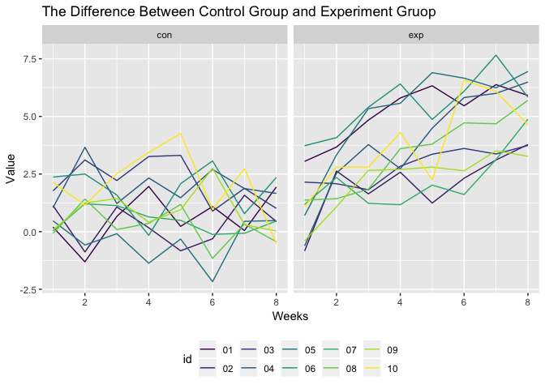

Homework5
================
Annie Yu
11/2/2018

``` r
library(tidyverse)
library(purrr)
library(rvest)
library(reshape2)
```

Problem 1
---------

### Create a tidy dataframe

``` r
long_study <- list.files('/Users/annie/Desktop/data science/Homework/homework5/Homework 5/data')  

df_longstudy <- function(x){
   read_df<- read_csv(paste0('/Users/annie/Desktop/data science/Homework/homework5/Homework 5/data/', x))
   read_df
}

output= map(long_study, df_longstudy)
week_results = bind_rows(output)

read_df<-long_study %>% 
  str_replace('.csv', '') 

df<-as.data.frame(read_df) 

longstudy<-
  cbind(df, week_results) %>% 
  gather(key = week, value = value, week_1:week_8) %>% 
  mutate(week = str_replace(week, 'week_', '')) %>% 
  mutate(week = as.numeric(week)) %>% 
  separate(read_df, into = c("arms", "id"),sep = "_") 
```

### Make a spaghetti plot showing observations on each subject over time, and comment on differences between groups.

``` r
ggplot(longstudy, aes(x= week, y = value, color=id))+
  facet_grid(~as.factor(arms))+
  geom_line()+
  labs(
    title = "The Difference Between Control Group and Experiment Gruop",
    x = "Weeks",
    y = "Value"
  )+
  viridis::scale_color_viridis(
    discrete = TRUE
  ) + 
  theme(legend.position = "bottom")
```



Problem 2
---------

### Reading，adding variable，and summarize total number and unsolved number of homicides

``` r
homicide = read_csv('/Users/annie/Desktop/data science/Homework/homework5/Homework 5/homicide-data.csv') 

homicide %>% 
  janitor::clean_names() %>% 
  mutate(city_state = paste(homicide$city,",",homicide$state))
```

    ## # A tibble: 52,179 x 13
    ##    uid   reported_date victim_last victim_first victim_race victim_age
    ##    <chr>         <int> <chr>       <chr>        <chr>       <chr>     
    ##  1 Alb-…      20100504 GARCIA      JUAN         Hispanic    78        
    ##  2 Alb-…      20100216 MONTOYA     CAMERON      Hispanic    17        
    ##  3 Alb-…      20100601 SATTERFIELD VIVIANA      White       15        
    ##  4 Alb-…      20100101 MENDIOLA    CARLOS       Hispanic    32        
    ##  5 Alb-…      20100102 MULA        VIVIAN       White       72        
    ##  6 Alb-…      20100126 BOOK        GERALDINE    White       91        
    ##  7 Alb-…      20100127 MALDONADO   DAVID        Hispanic    52        
    ##  8 Alb-…      20100127 MALDONADO   CONNIE       Hispanic    52        
    ##  9 Alb-…      20100130 MARTIN-LEY… GUSTAVO      White       56        
    ## 10 Alb-…      20100210 HERRERA     ISRAEL       Hispanic    43        
    ## # ... with 52,169 more rows, and 7 more variables: victim_sex <chr>,
    ## #   city <chr>, state <chr>, lat <dbl>, lon <dbl>, disposition <chr>,
    ## #   city_state <chr>

``` r
total_homicides <-
  homicide %>% 
  group_by(city) %>% 
  summarize(total = n(),
            unsolved = sum(disposition == "Closed without arrest" | disposition == "Open/No arrest")) %>% 
  ungroup()
```

### For the city of Baltimore, MD， estimate the proportion of homicides that are unsolved

``` r
baltimore_total <- subset(total_homicides, city =="Baltimore")$total
baltimore_unsolved <- subset(total_homicides, city == "Baltimore")$unsolved

prop_ba_unsolved <- prop.test(baltimore_unsolved, baltimore_total) %>% 
  broom::tidy() %>% 
  janitor::clean_names() %>% 
  select(estimate, conf_low, conf_high)

knitr::kable(prop_ba_unsolved)
```

|   estimate|  conf\_low|  conf\_high|
|----------:|----------:|-----------:|
|  0.6455607|  0.6275625|   0.6631599|

### Calculate for each of the cities, and extract both the proportion of unsolved homicides and the confidence interval for each

``` r
prop_hom = function(x){
   prop.test(x$unsolved, x$total) %>% 
   broom::tidy() %>%  
   janitor::clean_names() %>% 
   select(estimate, conf_low, conf_high)
}

all_prop <- nest(total_homicides, total:unsolved) %>% 
  mutate(result = map (data, prop_hom)) %>% 
  unnest()

as.tibble(all_prop)
```

    ## # A tibble: 50 x 6
    ##    city        total unsolved estimate conf_low conf_high
    ##    <chr>       <int>    <int>    <dbl>    <dbl>     <dbl>
    ##  1 Albuquerque   378      146    0.386    0.337     0.438
    ##  2 Atlanta       973      373    0.383    0.353     0.415
    ##  3 Baltimore    2827     1825    0.646    0.628     0.663
    ##  4 Baton Rouge   424      196    0.462    0.414     0.511
    ##  5 Birmingham    800      347    0.434    0.399     0.469
    ##  6 Boston        614      310    0.505    0.465     0.545
    ##  7 Buffalo       521      319    0.612    0.569     0.654
    ##  8 Charlotte     687      206    0.300    0.266     0.336
    ##  9 Chicago      5535     4073    0.736    0.724     0.747
    ## 10 Cincinnati    694      309    0.445    0.408     0.483
    ## # ... with 40 more rows

### The plot of estimates and CIs for each city

``` r
all_prop %>% 
  ggplot(aes(x= reorder(city, -estimate), y = estimate))+
  geom_point()+
  geom_errorbar(aes(x = city, ymin = conf_low, ymax = conf_high))+
  labs(
    title = "The plot of estimates and CIs for each city",
    x = "City",
    y = "Estimate with CI"
  )+
  theme(legend.position = "bottom", axis.text.x = element_text(angle = 90, hjust = 1), legend.key.width = unit(0.15,'cm'))
```


